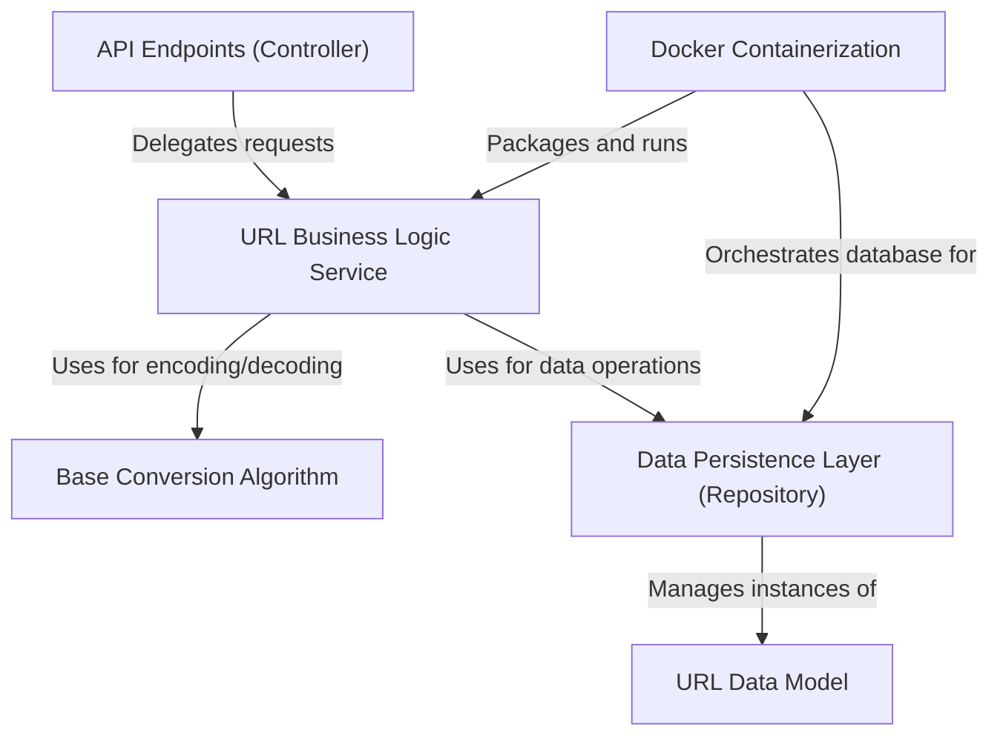

# Tutorial: UrlShortener-API

This project is a **Url Shortener API** that works like services such as *TinyURL*. Its main purpose is to transform long, cumbersome web addresses into *short, memorable links*. When a user accesses one of these short links, the API automatically redirects them to the original, long URL, making sharing and managing links much *simpler and more efficient*.

## Visual Overview

## Chapters

1. [API Endpoints (Controller)
](Chapter-1/01_api_endpoints__controller__.md)
2. [URL Business Logic Service
](02_url_business_logic_service_.md)
3. [Base Conversion Algorithm
](03_base_conversion_algorithm_.md)
4. [URL Data Model
](04_url_data_model_.md)
5. [Data Persistence Layer (Repository)
](05_data_persistence_layer__repository__.md)
6. [Docker Containerization
](06_docker_containerization_.md)

--- 
