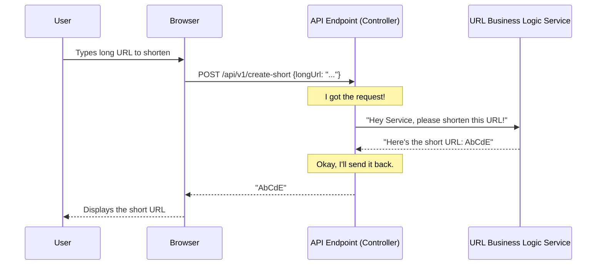

 
# Chapter 1: API Endpoints (Controller)

Imagine you want to use a magic online service that can take a super long web address (like `https://www.example.com/very/long/path/to/my/favorite/page.html`) and turn it into a tiny, easy-to-share link (like `http://short.url/abcde`). How do you tell this magic service what you want to do?

This is where **API Endpoints**, managed by something called a **Controller**, come into play! Think of the Controller as the **"front desk" or "receptionist"** of our URL Shortener application.

## What is an API Endpoint?

Let's break it down:

*   **API (Application Programming Interface):** Imagine an API as a restaurant's menu. It lists all the dishes you can order and how to order them. In our case, it's a set of rules and tools that lets different computer programs talk to each other.
*   **Endpoint:** If the API is the whole menu, an **endpoint** is a specific dish on that menu, or a specific phone number for a department. It's a specific address on the internet that your program can "call" to do something. For example, `http://short.url/api/v1/create-short` could be an endpoint to create a short URL.
*   **Controller:** This is the part of our application that handles all incoming requests for these endpoints. It's like the receptionist who greets you, understands what you want (based on the endpoint you're calling), and then directs your request to the right department (or "service") to get the actual work done. Once the work is done, the Controller also makes sure you get the right answer back.

## How Our URL Shortener Uses Endpoints (The Front Desk in Action!)

Let's see how our URL Shortener API uses endpoints to create and use short URLs.

### Use Case 1: Shortening a Long URL

You want to give our service a long URL and get a short one back.

*   **What you send:** The long URL you want to shorten.
*   **What you get back:** The newly created short URL.

Our `UrlController` has a specific "address" for this: `/api/v1/create-short`. When you send information to this address using a `POST` request (which is like "submitting a form"), the Controller understands you want to create a short URL.

Here's a peek at how our Controller is set up for this:

```java
// src/main/java/com/amarin/urlshortenerapi/controller/UrlController.java
// ... other imports

@RestController
@RequestMapping("/api/v1")
public class UrlController {

    private final UrlService urlService;

    public UrlController(UrlService urlService) {
        this.urlService = urlService;
    }

    @PostMapping("create-short")
    public String convertToShortUrl(@RequestBody UrlLongRequest request) {
        return urlService.convertToShortUrl(request); // Delegates to UrlService!
    }

    // ... other methods
}
```

**What's happening in this code?**

*   `@RestController`: This special tag tells Spring (the framework our app uses) that this Java class is our "front desk" or "Controller" for handling web requests.
*   `@RequestMapping("/api/v1")`: This sets the "base address" for all endpoints in this Controller. So, any endpoint defined here will start with `/api/v1/`.
*   `@PostMapping("create-short")`: This specifically defines an endpoint that responds to `POST` requests at the address `/api/v1/create-short`.
*   `@RequestBody UrlLongRequest request`: This means the Controller expects you to send the long URL information inside the "body" of your request. This information is neatly organized into a `UrlLongRequest` object.

The `UrlLongRequest` is a simple "data package" to hold the long URL:

```java
// src/main/java/com/amarin/urlshortenerapi/dto/UrlLongRequest.java
// ... other imports

public class UrlLongRequest {
    private String longUrl; // The actual long URL string
    // ... other properties and getter/setter methods
    public String getLongUrl() {
        return longUrl;
    }
}
```

**Example of how you'd "talk" to this endpoint:**

You would send a request to `http://your-app-address/api/v1/create-short` with a "body" like this:

```json
{
    "longUrl": "https://www.google.com/search?q=url+shortener+tutorial"
}
```

And the Controller would respond with something like:

```
http://short.url/AbCdE
```

### Use Case 2: Visiting a Short URL (Redirection)

Once you have a short URL, you want to be able to visit it and be automatically taken to the original long URL.

*   **What you send:** The short URL.
*   **What you get back:** You are *redirected* to the original long URL.

Our `UrlController` also has an endpoint for this: `/{shortUrl}`. The curly braces `{}` mean that whatever you type after the `/api/v1/` will be treated as the `shortUrl`. When you type this into your browser (which usually performs a `GET` request), the Controller takes that short URL and figures out where to redirect you.

Here's the code for this:

```java
// src/main/java/com/amarin/urlshortenerapi/controller/UrlController.java
// ... other imports

@RestController
@RequestMapping("/api/v1")
public class UrlController {

    // ... create-short method

    @GetMapping(value = "{shortUrl}")
    public ResponseEntity<Void> getAndRedirect(@PathVariable String shortUrl) {
        var url = urlService.getOriginalUrl(shortUrl); // Delegates to UrlService!
        return ResponseEntity.status(HttpStatus.FOUND)
                .location(URI.create(url))
                .build();
    }
}
```

**What's happening here?**

*   `@GetMapping(value = "{shortUrl}")`: This defines an endpoint that responds to `GET` requests. The `{shortUrl}` part means that whatever you put in that position in the URL (e.g., `AbCdE` if you visit `http://short.url/api/v1/AbCdE`) will be captured and given to our method as the `shortUrl` variable.
*   `@PathVariable String shortUrl`: This annotation links the `{shortUrl}` from the URL path to the `shortUrl` variable in our Java method.
*   `ResponseEntity.status(HttpStatus.FOUND).location(URI.create(url)).build()`: This is how the Controller tells your browser to redirect. `HttpStatus.FOUND` is a special code that means "I found what you're looking for, but it's at a different address. Go there instead!"

**Example of how you'd "talk" to this endpoint:**

You would simply type `http://your-app-address/api/v1/AbCdE` into your web browser.

The Controller would then find the original long URL associated with `AbCdE` (e.g., `https://www.google.com/search?q=url+shortener+tutorial`) and tell your browser to go there. You wouldn't see the short URL anymore; you'd immediately land on the original long page!

## Under the Hood: The Controller's Workflow

Let's use our "front desk" analogy again to understand what happens when a request comes in.



The key takeaway here is that the **API Endpoint (Controller) doesn't do the actual work of shortening the URL itself!** It's like the receptionist: they take your request, hand it over to the expert (the `URL Business Logic Service`), wait for the expert to finish, and then give you the result. This separation of duties is super important for keeping our code organized and easy to manage.

## Internal Implementation Details

Let's look at a bit more code to solidify this.

The `UrlController` is explicitly designed to work with the `UrlService`.

```java
// src/main/java/com/amarin/urlshortenerapi/controller/UrlController.java
package com.amarin.urlshortenerapi.controller;

import com.amarin.urlshortenerapi.dto.UrlLongRequest;
import com.amarin.urlshortenerapi.service.UrlService; // Import the service
// ... other imports

@RestController
@RequestMapping("/api/v1")
public class UrlController {

    // This is how the Controller knows about the UrlService
    private final UrlService urlService;

    // When the Controller is created, Spring automatically "injects" the UrlService here.
    public UrlController(UrlService urlService) {
        this.urlService = urlService;
    }

    // ... methods like convertToShortUrl and getAndRedirect
}
```

The line `private final UrlService urlService;` declares that our Controller needs a `UrlService` to do its job. The `public UrlController(UrlService urlService)` part tells Spring how to provide that service when the Controller starts up. This is a common technique called "Dependency Injection."

Then, inside our endpoint methods, we simply call methods on this `urlService` object:

```java
// Inside UrlController.java
// ...

    public String convertToShortUrl(@RequestBody UrlLongRequest request) {
        // We call the service's method to do the actual shortening!
        return urlService.convertToShortUrl(request);
    }

    public ResponseEntity<Void> getAndRedirect(@PathVariable String shortUrl) {
        // We call the service's method to find the original URL!
        var url = urlService.getOriginalUrl(shortUrl);
        return ResponseEntity.status(HttpStatus.FOUND)
                .location(URI.create(url))
                .build();
    }
```

The Controller's job is to:
1.  Receive the request.
2.  Understand which operation (shorten or redirect) is requested.
3.  Extract any necessary information (like the long URL or short URL).
4.  **Delegate** the actual complex work to the [URL Business Logic Service](02_url_business_logic_service_.md).
5.  Format the response and send it back to the client.

Finally, to make it easier for other developers (or even yourself in the future!) to understand what endpoints our API has, we use a tool called Swagger. It automatically generates documentation for our API based on our code!

```java
// src/main/java/com/amarin/urlshortenerapi/config/SwaggerConfig.java
package com.amarin.urlshortenerapi.config;

import org.springframework.context.annotation.Bean;
import org.springframework.context.annotation.Configuration;
import springfox.documentation.builders.ApiInfoBuilder;
import springfox.documentation.builders.PathSelectors;
import springfox.documentation.builders.RequestHandlerSelectors;
import springfox.documentation.service.ApiInfo;
import springfox.documentation.spi.DocumentationType;
import springfox.documentation.spring.web.plugins.Docket;
import springfox.documentation.swagger2.annotations.EnableSwagger2;

@Configuration
@EnableSwagger2
public class SwaggerConfig {

    @Bean
    public Docket apiDocket() {
        return new Docket(DocumentationType.SWAGGER_2)
                .apiInfo(metadata())
                .select()
                .apis(RequestHandlerSelectors.basePackage("com.amarin")) // Looks for Controllers in this package
                .build();
    }

    private ApiInfo metadata(){
        return new ApiInfoBuilder()
                .title("Url shortener API")
                .description("API reference for developers")
                .version("1.0")
                .build();
    }
}
```

This configuration tells Swagger to scan our `com.amarin` package (where `UrlController` lives) and automatically create a "user manual" for all our endpoints. This is incredibly helpful for anyone who wants to use our API!

## Conclusion

In this chapter, we learned that **API Endpoints (Controller)** act as the "front desk" of our URL shortener application. They are responsible for:

*   Receiving requests from users or other systems.
*   Defining specific web addresses (endpoints) that can be accessed.
*   Processing the incoming requests.
*   **Delegating** the actual work (like shortening URLs) to other parts of the application, specifically the [URL Business Logic Service](02_url_business_logic_service_.md).
*   Sending back the appropriate response.

Now that we understand how requests are received and directed, let's dive into where the real "magic" of shortening and finding URLs happens!

[Next Chapter: URL Business Logic Service](02_url_business_logic_service_.md)

---
