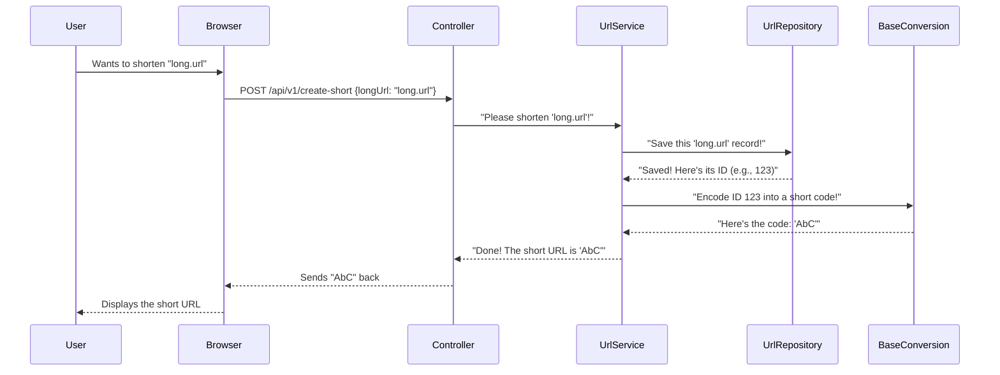
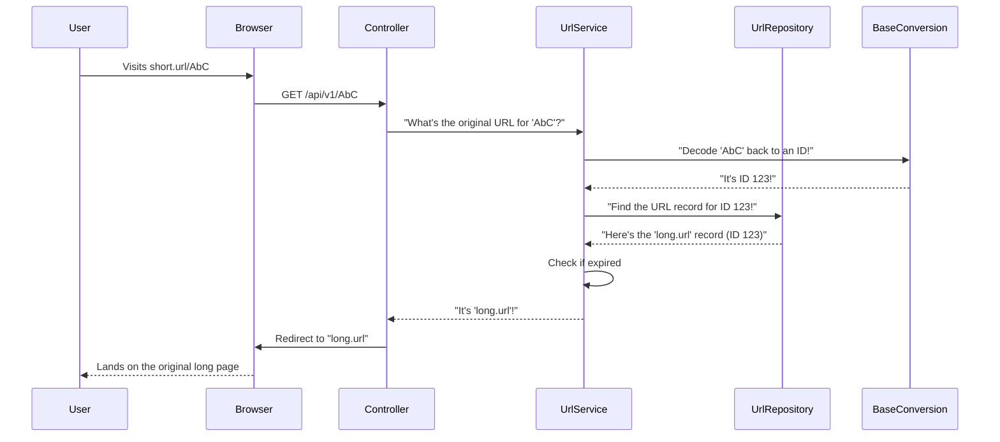

 
# Chapter 2: URL Business Logic Service

In [Chapter 1: API Endpoints (Controller)](01_api_endpoints__controller__.md), we learned that the Controller acts like the "front desk" of our URL Shortener application. It's responsible for greeting incoming requests, understanding what the user wants (e.g., "shorten this URL!" or "take me to the original URL!"), and then directing that request to the right place.

But the Controller doesn't actually *do* the complex work of shortening URLs or looking them up. That's like a receptionist handing your request for a new passport to the actual passport processing department.

This is where the **URL Business Logic Service** comes in! Think of this service as the **"brain"** or the **"expert department"** of our URL shortener. It's where all the core operations and smart decisions happen.

## What is the URL Business Logic Service?

The `UrlService` (that's what we call it in our code) is the central piece that handles all the "how-to" questions for our URL shortener:

*   **How do we generate a unique short code?**
*   **How do we save the connection between a long URL and its short code?**
*   **How do we find the original long URL when someone visits a short one?**
*   **What if a short URL has expired?**

By separating this "brain" logic from the "front desk" Controller, we keep our application organized and easier to understand, manage, and grow. This concept is called "separation of concerns" – each part of the app has its own specific job.

## Core Operations of the URL Business Logic Service

Let's look at the two main "problems" our `UrlService` solves:

### 1. Shortening a Long URL (The "Create" Operation)

When a user gives us a long URL and asks for a short one, the `UrlService` springs into action:

*   It takes the long URL provided by the user.
*   It creates a new entry (like a record in a notebook) to store this long URL.
*   It then figures out a unique, short code for this entry.
*   Finally, it tells the Controller what the new short URL is, so the Controller can send it back to the user.

**Here's how our `UrlService` starts to handle this:**

```java
// src/main/java/com/amarin/urlshortenerapi/service/UrlService.java

package com.amarin.urlshortenerapi.service;

import com.amarin.urlshortenerapi.dto.UrlLongRequest; // Data from the user
import com.amarin.urlshortenerapi.entity.Url;       // How we store URL info
import com.amarin.urlshortenerapi.repository.UrlRepository; // To save/load URLs
import org.springframework.stereotype.Service;
import java.util.Date; // For timestamps

@Service // Tells Spring this is a 'Service' component
public class UrlService {

    // These are other "tools" our service needs to do its job
    private final UrlRepository urlRepository; // For talking to the database
    private final BaseConversion conversion; // For making short codes

    // This is how the service gets its tools (Dependency Injection)
    public UrlService(UrlRepository urlRepository, BaseConversion baseConversion) {
        this.urlRepository = urlRepository;
        this.conversion = baseConversion;
    }

    // This method takes a long URL request and returns a short one
    public String convertToShortUrl(UrlLongRequest request) {
        var url = new Url(); // Create a new URL object
        url.setLongUrl(request.getLongUrl()); // Set the long URL from the request
        url.setExpiresDate(request.getExpiresDate()); // Set an expiration date if provided
        url.setCreatedDate(new Date()); // Record when it was created

        // We save this URL object to our database.
        // The database will give it a unique ID (like an entry number).
        var entity = urlRepository.save(url);

        // Now, we use the unique ID from the database to create the short code!
        return conversion.encode(entity.getId());
    }

    // ... other methods will go here
}
```

**What's happening in `convertToShortUrl`?**

1.  `new Url()`: We create a new "record" (an `Url` object) to store the long URL and other details. We'll learn more about the [URL Data Model](04_url_data_model_.md) later.
2.  `url.setLongUrl(...)`, `url.setExpiresDate(...)`, `url.setCreatedDate(new Date())`: We fill in the details of this new record.
3.  `urlRepository.save(url)`: This is where we ask another "department" (the [Data Persistence Layer (Repository)](05_data_persistence_layer__repository__.md)) to save our new URL record. When it saves, the database automatically gives it a unique ID number.
4.  `conversion.encode(entity.getId())`: We then take that unique ID number and give it to another "tool" (`BaseConversion`). This tool's job is to magically turn that ID number into a short, secret code (like turning `123` into `ABC`). We'll explore the [Base Conversion Algorithm](03_base_conversion_algorithm_.md) in the next chapter.
5.  The method then returns this short code.

### 2. Finding the Original URL (The "Redirect" Operation)

When someone visits a short URL (like `http://short.url/AbCdE`), the `UrlService` needs to figure out which original long URL it corresponds to and if it's still valid:

*   It takes the short code provided (e.g., `AbCdE`).
*   It figures out which unique ID number this short code represents.
*   It then uses that ID number to look up the original long URL in its records.
*   It checks if the link has expired.
*   If everything is good, it returns the original long URL, so the Controller can redirect the user. If not, it signals an error.

**Here's how our `UrlService` handles finding the original URL:**

```java
// src/main/java/com/amarin/urlshortenerapi/service/UrlService.java

// ... (previous code)

    public String getOriginalUrl(String shortUrl) {
        // First, we convert the short code back to its original ID number.
        var id = conversion.decode(shortUrl);

        // Then, we ask the database to find the URL record using that ID.
        // If not found, it throws an error.
        var entity = urlRepository.findById(id)
                .orElseThrow(() -> new EntityNotFoundException("No URL found for " + shortUrl));

        // Now, we check if the link has expired.
        // If it has an expiration date AND that date is in the past...
        if (entity.getExpiresDate() != null && entity.getExpiresDate().before(new Date())){
            urlRepository.delete(entity); // ... we delete the expired link from the database
            throw new EntityNotFoundException("Link expired!"); // ... and tell the user it's expired.
        }

        // If not expired, we return the original long URL!
        return entity.getLongUrl();
    }
}
```

**What's happening in `getOriginalUrl`?**

1.  `conversion.decode(shortUrl)`: We use our `BaseConversion` "tool" again, but this time to reverse the process. It takes the short code (like `AbCdE`) and converts it back into its original ID number (like `123`).
2.  `urlRepository.findById(id)`: We then ask our [Data Persistence Layer (Repository)](05_data_persistence_layer__repository__.md) to find the full `Url` record associated with that ID. If it can't find it, it signals an error.
3.  `if (entity.getExpiresDate() != null && entity.getExpiresDate().before(new Date()))`: This is a "business rule" check! Our service decides if the link is still valid based on its expiration date.
4.  `urlRepository.delete(entity)`: If the link *is* expired, we clean it up by deleting it from the database.
5.  `throw new EntityNotFoundException("Link expired!")`: We then signal an error because the link is no longer valid.
6.  `return entity.getLongUrl()`: If the link is found and not expired, the service happily returns the original long URL.

## Under the Hood: The Service's Workflow

Let's combine what we learned about the Controller and the Service.

### Workflow 1: Shortening a URL



### Workflow 2: Visiting a Short URL (Redirection)



These diagrams show how the `UrlService` acts as the central orchestrator for the core logic, communicating with other specialized components (`UrlRepository` and `BaseConversion`) to get its job done.

## Connecting the Pieces: How UrlService gets its "Tools"

Notice how `UrlService` has `private final UrlRepository urlRepository;` and `private final BaseConversion conversion;`? These are like the specialized "tools" or "departments" it needs to perform its operations.

Our application framework (Spring) automatically provides these tools to the `UrlService` when it's created. This helpful mechanism is called **Dependency Injection**. It means `UrlService` *depends* on `UrlRepository` and `BaseConversion`, and Spring *injects* them (provides them) automatically, so `UrlService` doesn't have to worry about creating them itself.

```java
// src/main/java/com/amarin/urlshortenerapi/service/UrlService.java
// ...

@Service // Tells Spring this is a 'Service' component that can be injected
public class UrlService {

    private final UrlRepository urlRepository; // Needs the data storage tool
    private final BaseConversion conversion;   // Needs the short code generation tool

    // This is how Spring knows what to "inject" when it creates a UrlService
    public UrlService(UrlRepository urlRepository, BaseConversion baseConversion) {
        this.urlRepository = urlRepository;
        this.conversion = baseConversion;
    }

    // ... methods like convertToShortUrl and getOriginalUrl
}
```

This setup makes our code very modular. If we ever wanted to change how we store URLs (e.g., use a different database), we'd only need to change the `UrlRepository` implementation, and the `UrlService` wouldn't need to know anything about the change!

## Conclusion

The **URL Business Logic Service** (our `UrlService`) is the true "brain" of our URL shortener. It handles the core logic of:

*   Taking a long URL, saving it, and creating a short code.
*   Taking a short code, looking up the original URL, and checking its validity.

It works closely with the [API Endpoints (Controller)](01_api_endpoints__controller__.md) (which direct requests to it), the [URL Data Model](04_url_data_model_.md) (which defines the structure of the data it handles), the [Data Persistence Layer (Repository)](05_data_persistence_layer__repository__.md) (which helps it save and retrieve data), and the [Base Conversion Algorithm](03_base_conversion_algorithm_.md) (which generates and decodes the short codes).

Now that we understand what the `UrlService` does, let's dive into one of its most interesting "tools": the magic behind generating those unique short codes!

[Next Chapter: Base Conversion Algorithm](03_base_conversion_algorithm_.md)

---
