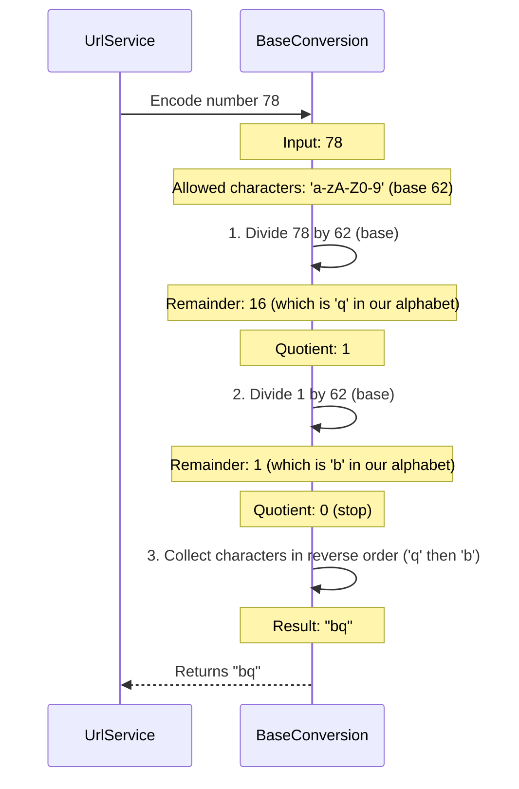
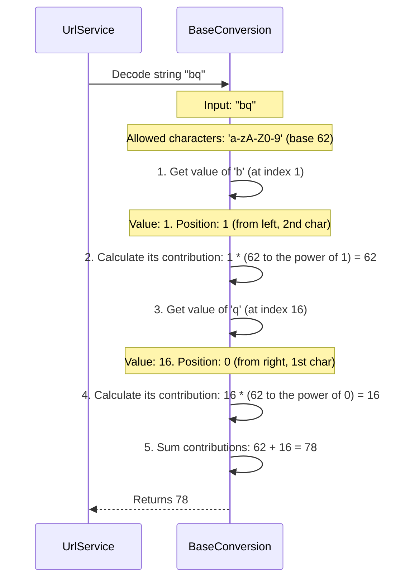

 
# Chapter 3: Base Conversion Algorithm

In [Chapter 2: URL Business Logic Service](02_url_business_logic_service_.md), we learned that our `UrlService` acts as the "brain" of our URL shortener. It handles the clever work of saving long URLs and figuring out their short codes. We saw that to create a short URL, the `UrlService` relies on a special "tool" called `BaseConversion` to turn a regular ID number (like `123`) into a short, unique string (like `AbC`).

Now, let's open the toolbox and understand this fascinating "tool" in detail!

## What is a Base Conversion Algorithm?

Imagine you have a super long secret code, but you need to send it as a very short message. You also need to be able to turn that short message back into the original long code later. This is exactly what a **Base Conversion Algorithm** does for our URL shortener!

Think of it as a special "code translator" or a "number system converter."

*   **Problem it solves:** Our database gives each saved long URL a unique identification number (like `1`, `2`, `3`, `100`, `1000`, etc.). These numbers can get quite large. We can't just use the number `12345` as a short URL because it's still pretty long. We want something much shorter, like `f3gH7`.
*   **The solution:** The Base Conversion Algorithm takes that long numerical ID and *encodes* it into a much shorter string of letters and numbers. When someone clicks on that short string, it *decodes* it back into the original numerical ID, so we can find the correct long URL in our database.

This is fundamental to creating those compact and unique short links you see everywhere!

## How Our URL Shortener Uses It

Our `BaseConversion` tool has two main jobs:

1.  **`encode` (Making it short):** Takes a numerical ID (from the database) and turns it into a compact string.
    *   **Input:** A number, e.g., `100`.
    *   **Output:** A short string, e.g., `"1C"`.
2.  **`decode` (Making it long again):** Takes a compact string (from the short URL) and turns it back into the original numerical ID.
    *   **Input:** A short string, e.g., `"1C"`.
    *   **Output:** The original number, e.g., `100`.

The `UrlService` (from Chapter 2) uses these methods directly:

*   When shortening a URL: `return conversion.encode(entity.getId());`
*   When redirecting a short URL: `var id = conversion.decode(shortUrl);`

## The "Alphabet" for Our Short URLs

To create short strings, we need a special "alphabet" that includes not just letters, but also numbers. This is much larger than the regular 26-letter alphabet, allowing us to create many more unique short codes with fewer characters.

Our `BaseConversion` algorithm uses this specific set of characters:

```java
// src/main/java/com/amarin/urlshortenerapi/service/BaseConversion.java
// ...
public class BaseConversion {

    // Our "alphabet" for short URLs
    private static final String allowedString = "abcdefghijklmnopqrstuvwxyzABCDEFGHIJKLMNOPQRSTUVWXYZ0123456789";
    private char[] allowedCharacters = allowedString.toCharArray();
    private int base = allowedCharacters.length; // The size of our alphabet (62 characters)

    // ... encode and decode methods
}
```

*   `allowedString`: Contains all the characters our short URLs can use (lowercase letters, uppercase letters, and digits 0-9).
*   `base`: This is the *size* of our custom "alphabet." Since we have 26 lowercase + 26 uppercase + 10 digits = 62 characters, our `base` is `62`. This is why it's called "base conversion" – we're converting numbers into a system with a base of 62, instead of the usual base-10 (decimal) or base-2 (binary).

## How Encoding Works (The Secret Code Generator)

Let's imagine you have a number, say `78`, that you want to encode. How does the algorithm turn it into something like `bq`?



The `encode` method works like this:

1.  It takes the input number (e.g., `78`).
2.  It repeatedly divides the number by our `base` (which is `62`).
3.  Each time, it takes the **remainder** of the division. This remainder tells us which character from our `allowedCharacters` list to pick.
4.  It collects these characters.
5.  Finally, it **reverses** the order of the collected characters to get the final short code.

Here's a simplified look at the `encode` code:

```java
// src/main/java/com/amarin/urlshortenerapi/service/BaseConversion.java
// ...
public class BaseConversion {
    // ... allowedString, allowedCharacters, base

    public String encode(long input){
        var encodedString = new StringBuilder();

        if(input == 0) {
            return String.valueOf(allowedCharacters[0]); // Special case for ID 0
        }

        while (input > 0) {
            // Get the remainder, find the character for it
            encodedString.append(allowedCharacters[(int) (input % base)]);
            // Update input to the quotient for the next round
            input = input / base;
        }

        return encodedString.reverse().toString(); // Reverse for the correct order
    }

    // ... decode method
}
```

**What's happening in this code?**

*   `input % base`: This calculates the remainder when `input` is divided by `base`. This remainder is used as an index to pick a character from `allowedCharacters`. For `78 % 62 = 16`. The 16th character in our `allowedCharacters` is 'q'.
*   `input = input / base`: This updates the `input` to the whole number result of the division. For `78 / 62 = 1`. This `1` becomes the new `input` for the next loop.
*   The loop continues until `input` becomes `0`.
*   `encodedString.append(...)`: Adds the character to our temporary string.
*   `encodedString.reverse().toString()`: After the loop, the characters are in reverse order, so we flip them to get the correct short code (`bq`).

## How Decoding Works (The Secret Code Decoder)

Now, how do we get `78` back from `bq`?



The `decode` method reverses the process:

1.  It takes the short string (e.g., `"bq"`).
2.  It looks at each character from left to right.
3.  For each character, it finds its numerical value within our `allowedString` (e.g., 'b' is `1`, 'q' is `16`).
4.  It then calculates its contribution to the final number based on its position in the string and our `base` (62).
5.  It adds all these contributions together.

Here's a simplified look at the `decode` code:

```java
// src/main/java/com/amarin/urlshortenerapi/service/BaseConversion.java
// ...
public class BaseConversion {
    // ... allowedString, allowedCharacters, base

    // ... encode method

    public long decode(String input) {
        var characters = input.toCharArray(); // Convert string to an array of characters
        var length = characters.length; // How many characters are there

        var decoded = 0; // This will be our final decoded number

        // counter helps us figure out the correct power of 'base'
        var counter = 1;
        for (int i = 0; i < length; i++) {
            // Find the numerical value of the character (e.g., 'a' is 0, 'b' is 1)
            int charValue = allowedString.indexOf(characters[i]);
            // Calculate its contribution: value * (base ^ (position from right))
            decoded += charValue * Math.pow(base, length - counter);
            counter++; // Move to the next character
        }
        return decoded;
    }
}
```

**What's happening in this code?**

*   `allowedString.indexOf(characters[i])`: This finds the position (index) of the current character in our `allowedString`. For example, `allowedString.indexOf('b')` returns `1`, and `allowedString.indexOf('q')` returns `16`.
*   `Math.pow(base, length - counter)`: This calculates `base` raised to a certain power. The power depends on the character's position. For `bq` (length 2):
    *   For 'b' (first char, `counter`=1): `Math.pow(62, 2 - 1)` which is `62^1 = 62`.
    *   For 'q' (second char, `counter`=2): `Math.pow(62, 2 - 2)` which is `62^0 = 1`.
*   `decoded += ...`: Adds the calculated value for each character to the `decoded` total. So, for `bq`: (`1` * `62`) + (`16` * `1`) = `62 + 16 = 78`.

This clever mathematical process is what allows us to convert between a large range of numbers and very compact strings.

## Testing Our Conversion

To make sure our `BaseConversion` algorithm works correctly, developers write tests. For instance, the `BaseConversionTest.java` file contains simple tests to check if `encode` and `decode` produce the expected results.

For example, a test might check that `encode(10)` correctly returns `"k"` and `decode("l")` correctly returns `11`. These tests help ensure our "code translator" is always working as expected.

## Conclusion

The **Base Conversion Algorithm** is the unsung hero of our URL shortener. It's the specialized "code translator" that enables us to:

*   **Encode:** Turn large numerical IDs from our database into compact, unique short strings (like `AbCdE`).
*   **Decode:** Convert those short strings back into their original numerical IDs, allowing our application to find the corresponding long URL.

This algorithm is crucial for generating those tidy, shareable short links we all use. Without it, our short URLs would just be long numbers!

Now that we understand how the short codes are generated and decoded, let's look at the structure of the data itself – how we actually represent and store a URL's information in our application.

[Next Chapter: URL Data Model](04_url_data_model_.md)

---

