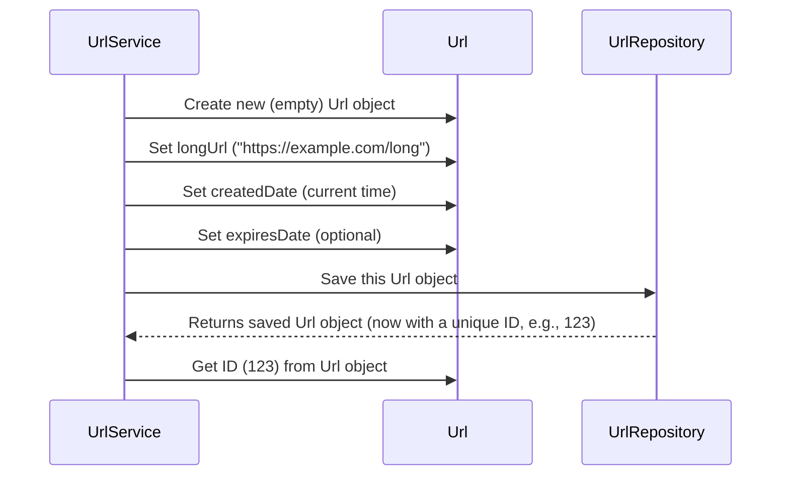
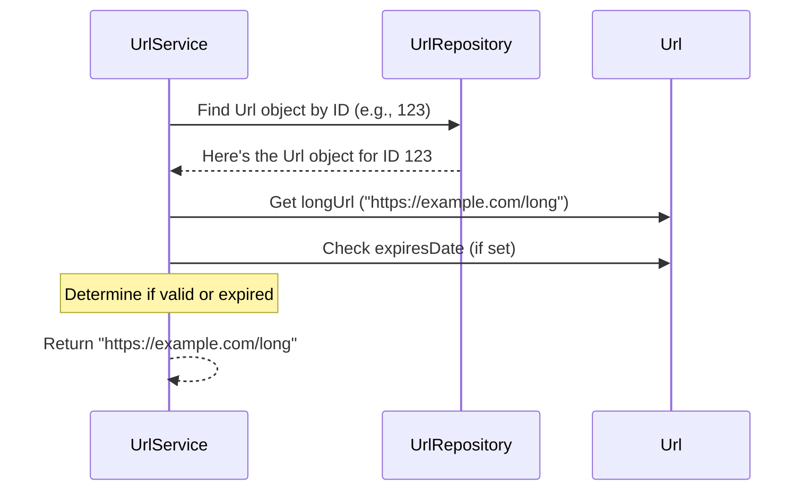

 # Chapter 4: URL Data Model

In the previous chapters, we learned how the [API Endpoints (Controller)](01_api_endpoints__controller__.md) receive requests and how the [URL Business Logic Service](02_url_business_logic_service_.md) acts as the "brain" to process them, even using a clever [Base Conversion Algorithm](03_base_conversion_algorithm_.md) to create short codes from numbers.

But what happens when the `UrlService` needs to remember a long URL, its unique short identifier, when it was created, and if it should expire? How does it keep all this related information together?

This is where the **URL Data Model** comes in!

## What is a URL Data Model?

Imagine you're running a library. Every time a new book arrives, you create a "book card" for it. This card isn't the book itself, but it holds all the important information *about* that book: its title, author, publication date, and a unique ID number that tells you where to find it on the shelf.

In our URL Shortener, a **URL Data Model** is exactly like that "book card." It's a **blueprint** or a **template** that defines how we store *all the essential information* about a single shortened URL. This "blueprint" creates something we call a `Url` **object** (or **entity** in database terms).

Each `Url` object is a neat package containing everything we need to know about one specific short link:

*   **Its unique ID:** A number that identifies it in our system.
*   **The original long URL:** The website address it points to.
*   **When it was created:** A timestamp of when the short link was generated.
*   **When it expires (optional):** A date after which the short link should stop working.

The application uses these `Url` objects to store, retrieve, and manage all the short URLs, just like a librarian uses book cards to manage their books.

## The Core Blueprint: What's Inside Our `Url` Object?

Let's look at the "ingredients" or "properties" that make up our `Url` data model. These are the pieces of information each `Url` object will hold:

*   **`id`**: This is a unique number that our database automatically gives to each `Url` entry. Think of it as the **unique identification number** for each shortened link. This `id` is super important because it's what our [Base Conversion Algorithm](03_base_conversion_algorithm_.md) turns into the short, cryptic code (like `AbCdE`).
*   **`longUrl`**: This is the **original, full-length web address** that the user wants to shorten (e.g., `https://www.example.com/very/long/page`).
*   **`createdDate`**: This is a timestamp that records **exactly when** the short URL was created. It helps us track how old a link is.
*   **`expiresDate`**: This is an **optional** date. If a user wants their short link to only work for a limited time, we can set this. If someone tries to use the link after this date, our system will know it's "expired."

## How the `UrlService` Uses the `Url` Data Model

Remember our `UrlService` from [Chapter 2: URL Business Logic Service](02_url_business_logic_service_.md)? It's the "brain" that does the work. The `Url` data model is what that "brain" works *with*.

### Use Case 1: Shortening a Long URL (Creating a `Url` Object)

When you ask the `UrlService` to shorten a long URL, it needs to create a new `Url` object to store all the information.

Here's a simplified look at how the `UrlService` uses the `Url` data model:

```java
// Inside UrlService.java (simplified)
// ...
public class UrlService {
    // ... (other parts of the service)

    public String convertToShortUrl(UrlLongRequest request) {
        // 1. Create a new "empty" Url object (our new "book card")
        var url = new Url();

        // 2. Fill in the details on this "book card"
        url.setLongUrl(request.getLongUrl()); // The long URL
        url.setExpiresDate(request.getExpiresDate()); // Optional expiration date
        url.setCreatedDate(new Date()); // Today's date and time

        // 3. Ask the database to save this completed "book card"
        var savedUrlEntity = urlRepository.save(url);

        // 4. Get the unique ID that the database gave it
        return conversion.encode(savedUrlEntity.getId());
    }
    // ...
}
```

**What's happening here?**

1.  `new Url()`: We create an empty `Url` object, like grabbing a blank "book card."
2.  `url.setLongUrl(...)`, `url.setExpiresDate(...)`, `url.setCreatedDate(...)`: We fill in the necessary information on our "book card."
3.  `urlRepository.save(url)`: We pass our filled-out `Url` object to another part of the system (the `urlRepository`, which handles talking to the database). It saves the `Url` object and gives it a unique `id`.
4.  `savedUrlEntity.getId()`: We then use this unique `id` to create the short code.

This process ensures that all the relevant pieces of information for a shortened URL are kept together in one `Url` object.

### Use Case 2: Visiting a Short URL (Retrieving a `Url` Object)

When someone visits a short URL, the `UrlService` needs to find the corresponding `Url` object to get the original long URL.

```java
// Inside UrlService.java (simplified)
// ...
public class UrlService {
    // ... (other parts of the service)

    public String getOriginalUrl(String shortUrl) {
        // 1. Decode the short URL to get its unique ID
        var id = conversion.decode(shortUrl);

        // 2. Ask the database to find the Url object with this ID
        var entity = urlRepository.findById(id)
                .orElseThrow(() -> new RuntimeException("URL not found!"));

        // 3. Now that we have the Url object, we can get its longUrl
        return entity.getLongUrl();
    }
}
```

**What's happening here?**

1.  `conversion.decode(shortUrl)`: The `UrlService` first uses the `BaseConversion` tool to convert the short code (like `AbCdE`) back into its original numerical `id` (like `123`).
2.  `urlRepository.findById(id)`: It then asks the `urlRepository` (our database helper) to find the `Url` object that has this specific `id`.
3.  `entity.getLongUrl()`: Once the `Url` object is found, the `UrlService` can easily get the `longUrl` property from it and return it.

## Under the Hood: The `Url` Class in Code

Let's look at the actual code that defines our `Url` data model. This is just a plain Java class, but it has some special "labels" (called annotations) that tell our application and the database how to treat it.

```java
// src/main/java/com/amarin/urlshortenerapi/entity/Url.java
package com.amarin.urlshortenerapi.entity;

import javax.persistence.*; // Important labels for databases
import java.util.Date; // For dates and times

@Entity // A special label: "This class represents something we want to save in our database!"
@Table(name = "url") // Another label: "Save these Url objects in a database table called 'url'!"
public class Url {
    // ... (fields and methods explained below)
}
```
*   `@Entity`: This is a very important label from Java's Persistence API (JPA). It tells our application that objects of this `Url` class can be stored as records in a database.
*   `@Table(name = "url")`: This label tells the application that when we save `Url` objects, they should go into a database table named "url."

Next, let's look at the actual pieces of information (fields) and their labels:

```java
// Inside Url.java
public class Url {

    @Id // This field is the unique ID for each entry (like a primary key)
    @GeneratedValue(strategy = GenerationType.AUTO) // Let the database automatically create this unique ID for us
    private long id; // Our unique short URL identifier (a number)

    @Column(nullable = false) // This field (longUrl) cannot be empty when saved
    private String longUrl; // The original long web address

    @Column(nullable = false) // This field (createdDate) also cannot be empty
    private Date createdDate; // When the short URL was created

    private Date expiresDate; // This field is optional (no @Column(nullable=false))
    // ... (getters and setters explained below)
}
```

*   `@Id`: Marks the `id` field as the primary key for this entity. This is how each `Url` record is uniquely identified in the database.
*   `@GeneratedValue(strategy = GenerationType.AUTO)`: Tells the database to automatically generate a value for `id` whenever a new `Url` object is saved. We don't have to worry about creating unique IDs ourselves; the database handles it!
*   `@Column(nullable = false)`: This ensures that `longUrl` and `createdDate` must have a value when a `Url` object is saved. They cannot be left empty.
*   `expiresDate`: Does not have `@Column(nullable = false)`, meaning it *can* be empty (or `null`), which makes sense because not all short URLs will have an expiration date.

Finally, to access or change these pieces of information within a `Url` object, we use special methods called **"getters"** and **"setters."**

*   **Getters:** Allow you to "get" the value of a property. For example, `url.getLongUrl()` would give you the `String` value of the original long URL stored in that `url` object.
*   **Setters:** Allow you to "set" or change the value of a property. For example, `url.setLongUrl("new.long.url")` would update the `longUrl` property of that `url` object.

Here's an example of one getter and one setter:

```java
// Inside Url.java
// ... (fields)

    public String getLongUrl() { // Getter for longUrl
        return longUrl;
    }

    public void setLongUrl(String longUrl) { // Setter for longUrl
        this.longUrl = longUrl;
    }
    // ... (other getters and setters for id, createdDate, expiresDate)
}
```
These getter and setter methods are how other parts of our application (like the `UrlService`) interact with the `Url` object's data.

## Workflow: How Data Flows with the `Url` Object

Let's visualize how the `Url` object is used when we perform our two main operations:

### Workflow 1: Creating a Short URL

When you ask to shorten a URL:


The `UrlService` prepares the `Url` object and then hands it over to the `UrlRepository` to be saved in the database. The `UrlRepository` then returns the same `Url` object, but now it has its unique `id` filled in by the database.

### Workflow 2: Visiting a Short URL (Redirection)

When someone visits a short URL:


Here, the `UrlService` asks the `UrlRepository` to *fetch* a `Url` object from the database using its `id`. Once it gets the `Url` object, it can then access its `longUrl` property (and check `expiresDate`) to perform the redirection.

## Conclusion

The **URL Data Model**, defined by our `Url` class, is the essential blueprint for how we store information about each shortened link in our system. It's like the "recipe card" that keeps all the important details (`id`, `longUrl`, `createdDate`, `expiresDate`) together in one logical package.

This organized approach to data is crucial for our `UrlService` to efficiently create, retrieve, and manage all the short URLs. Now that we understand *what* data we're storing and *how* it's structured, the next logical step is to learn *where* and *how* this data is actually saved and loaded from a database.

[Next Chapter: Data Persistence Layer (Repository)](05_data_persistence_layer__repository__.md)

---
