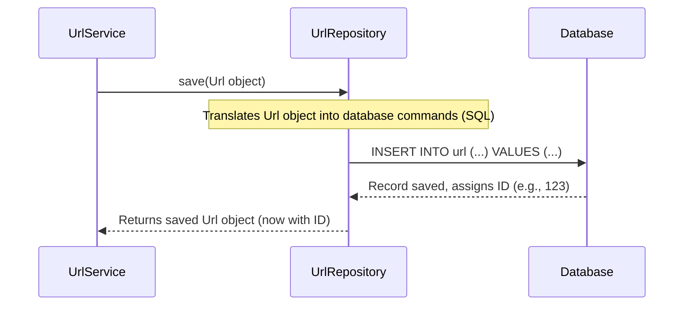
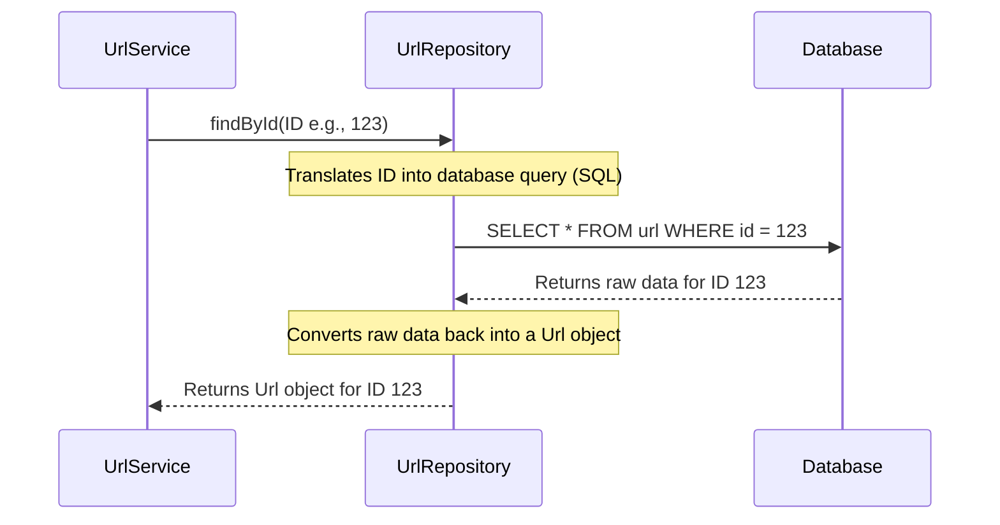

# Chapter 5: Data Persistence Layer (Repository)

In [Chapter 4: URL Data Model](04_url_data_model_.md), we learned about the `Url` data model, which is like a blueprint for storing all the important information about a single shortened URL (its long URL, creation date, ID, etc.). We understood that the [URL Business Logic Service](02_url_business_logic_service_.md) (our `UrlService`) works with these `Url` objects.

But here's a crucial question: where do these `Url` objects actually *live* when our application isn't running? If we shut down our URL shortener, we don't want to lose all the links! We need a place to permanently store them, like a giant digital filing cabinet. This permanent storage is called a **database**.

However, the `UrlService` (our application's "brain") doesn't want to worry about the complicated commands needed to talk to a database. It just wants to say, "Save this URL record!" or "Find me the URL record for this ID!"

This is where the **Data Persistence Layer**, often called the **Repository**, comes to the rescue!

## What is the Data Persistence Layer (Repository)?

Think of the **Repository** as the **"librarian"** for all our `Url` records. When the [URL Business Logic Service](02_url_business_logic_service_.md) needs to save a new `Url` object or find an existing one, it doesn't talk directly to the complex "database shelves." Instead, it talks to the `UrlRepository`.

Here's what our "librarian" (the `UrlRepository`) is responsible for:

*   **Communicating with the database:** It knows the secret language and rules needed to store and retrieve information from our database.
*   **Providing simple methods:** It offers easy-to-use "buttons" or "methods" to the `UrlService` like:
    *   `save()`: "Librarian, please put this new `Url` record on the shelf!"
    *   `findById()`: "Librarian, find me the `Url` record with this specific ID number!"
    *   `delete()`: "Librarian, please remove this expired `Url` record from the shelf!"
*   **Hiding complexity:** The `UrlService` doesn't need to know *how* the librarian finds or stores the books (or `Url` records). It just asks, and the librarian handles all the intricate details of talking to the database. This makes our `UrlService` simpler and cleaner!

## How Our URL Shortener Uses the Repository

Let's see how the `UrlService` relies on the `UrlRepository` to manage our `Url` data.

### 1. Saving a New URL Record

When the [URL Business Logic Service](02_url_business_logic_service_.md) wants to shorten a new long URL, it first prepares a `Url` object (our "book card" from [Chapter 4](04_url_data_model_.md)). Then, it asks the `UrlRepository` to save it.

```java
// Inside UrlService.java (simplified)

// ... (other parts of the service)

// This method shortens a long URL
public String convertToShortUrl(UrlLongRequest request) {
    var url = new Url(); // Create a new Url object
    url.setLongUrl(request.getLongUrl()); // Fill in details
    url.setCreatedDate(new Date());

    // Ask the UrlRepository (our librarian) to save this Url object!
    // The database will give it a unique ID when saved.
    var savedUrl = urlRepository.save(url);

    // Then, use the ID to create the short code
    return conversion.encode(savedUrl.getId());
}
```

**What happens here?**

The `urlRepository.save(url)` line is where the magic happens! The `UrlService` hands over the `Url` object to the `UrlRepository`. The `UrlRepository` then takes this object, figures out how to store it permanently in the database, and returns the saved `Url` object (which now includes the unique `id` assigned by the database).

### 2. Finding an Original URL Record

When someone visits a short URL, the [URL Business Logic Service](02_url_business_logic_service_.md) needs to find the original long URL associated with that short code. It first decodes the short code to get the unique ID, and then asks the `UrlRepository` to fetch the `Url` object with that ID.

```java
// Inside UrlService.java (simplified)

// ... (other parts of the service)

// This method finds the original URL for a given short URL
public String getOriginalUrl(String shortUrl) {
    // Decode the short URL to get its ID (e.g., "AbC" -> 123)
    var id = conversion.decode(shortUrl);

    // Ask the UrlRepository to find the Url object by its ID!
    // If not found, it throws an error.
    var entity = urlRepository.findById(id)
            .orElseThrow(() -> new EntityNotFoundException("URL not found!"));

    // Now, check if the link is expired (business logic)
    // ...

    // Return the original long URL from the found object
    return entity.getLongUrl();
}
```

**What happens here?**

The `urlRepository.findById(id)` line is how the `UrlService` asks the `UrlRepository` to retrieve a specific `Url` record. The `UrlRepository` goes to the database, finds the record corresponding to that `id`, converts it back into a `Url` object, and gives it back to the `UrlService`.

### 3. Deleting an Expired URL Record

Our `UrlService` also has a rule: if a link has an `expiresDate` and that date is in the past, the link should no longer work and should be removed from the database to keep things tidy.

```java
// Inside UrlService.java (simplified)

// ... (inside getOriginalUrl method, after checking expiration)

    if (entity.getExpiresDate() != null && entity.getExpiresDate().before(new Date())){
        // If expired, ask the UrlRepository to delete this Url object!
        urlRepository.delete(entity);
        throw new EntityNotFoundException("Link expired!");
    }
```

**What happens here?**

The `urlRepository.delete(entity)` line tells the `UrlRepository` to remove the specified `Url` object's record from the database.

## Under the Hood: The `UrlRepository` in Code

In our project, we use a powerful tool from the Spring framework called **Spring Data JPA** to create our Repositories. It's so smart that we hardly need to write any code ourselves!

Here's what our `UrlRepository` looks like:

```java
// src/main/java/com/amarin/urlshortenerapi/repository/UrlRepository.java
package com.amarin.urlshortenerapi.repository;

import com.amarin.urlshortenerapi.entity.Url; // Our Url data model
import org.springframework.data.jpa.repository.JpaRepository; // The magic tool!
import org.springframework.stereotype.Repository; // Tells Spring this is a Repository

@Repository // Another label for Spring
public interface UrlRepository extends JpaRepository<Url, Long> {
    // That's it! No other code needed here!
}
```

**What's happening here?**

*   `public interface UrlRepository`: This tells Java that `UrlRepository` is an `interface`. An interface is like a "contract" that says, "Anyone who uses me can expect these methods to be available."
*   `extends JpaRepository<Url, Long>`: This is the real magic! `JpaRepository` is a special interface provided by Spring Data JPA. By extending it, our `UrlRepository` automatically inherits a whole bunch of powerful methods for working with databases, like `save()`, `findById()`, `delete()`, and many more!
    *   `<Url, Long>`: This part tells `JpaRepository` two things:
        *   `Url`: This Repository will manage objects of our `Url` [data model](04_url_data_model_.md).
        *   `Long`: The unique ID (primary key) of our `Url` objects is a `Long` number.

So, even though we don't write the code for `save()` or `findById()` in `UrlRepository.java`, Spring Data JPA automatically provides all of that for us behind the scenes! It translates our simple method calls into complex database commands (like SQL queries).

### Connecting to the Database

For the `UrlRepository` to do its job, it needs to know *which* database to connect to. This information is stored in a special configuration file:

```properties
# src/main/resources/application.properties

# Database connection details
spring.datasource.url = jdbc:mysql://mysql-local:3306/shortener?allowPublicKeyRetrieval=true&useSSL=FALSE
spring.datasource.username = root
spring.datasource.password = root

## Hibernate Properties
# Hibernate ddl auto (create, create-drop, validate, update)
spring.jpa.hibernate.ddl-auto = update
```

*   `spring.datasource.url`, `username`, `password`: These lines tell our application how to find and log into our MySQL database.
*   `spring.jpa.hibernate.ddl-auto = update`: This is a helpful setting that tells Spring to automatically create or update the database tables (like our `url` table for `Url` objects) based on our `Url` [data model](04_url_data_model_.md). We don't have to write SQL commands to create tables!

### Automated Cleanup (Event Scheduler)

As an extra detail related to persistence, our project includes a database `event scheduler` that automatically cleans up expired links directly within the database:

```sql
-- database/even_scheduler_delete.sql
SET GLOBAL event_scheduler = ON;

create event cleaning
on schedule every 2 minute
starts current_timestamp()
do
	delete from shortener.url
    where url.expires_date < now();
```

This SQL code sets up a scheduled task inside the database itself. Every 2 minutes, it looks for any `Url` records where the `expires_date` is older than the current time and deletes them. This is another way our application ensures that old, unused data doesn't clutter our database, even without our application running!

## Workflow: How Data Moves with the Repository

Let's visualize the "librarian" at work:

### Workflow 1: Saving a URL Record

When the `UrlService` wants to save a new `Url` object:



### Workflow 2: Retrieving a URL Record

When the `UrlService` needs to find an existing `Url` object:



As you can see, the `UrlRepository` acts as a crucial intermediary, simplifying how our application interacts with the database.

## Conclusion

The **Data Persistence Layer (Repository)** is our application's dedicated "librarian" or "data manager." Its primary role is to:

*   **Abstract database interactions:** It hides the complex details of database commands from the main business logic.
*   **Provide standard operations:** It gives simple methods like `save`, `findById`, and `delete` to manage `Url` objects.
*   **Ensure data persistence:** It makes sure our `Url` records are safely stored in the database and can be retrieved even after the application restarts.

Thanks to the Repository, our [URL Business Logic Service](02_url_business_logic_service_.md) can focus on the "what" (shorten, find, check expiration) without getting bogged down in the "how" (database queries).

Now that our application can talk to a database and store URL records, the next exciting step is to package our entire application into a neat, self-contained unit that can run anywhere easily. This is where **Docker Containerization** comes in!

[Next Chapter: Docker Containerization](06_docker_containerization_.md)

---
