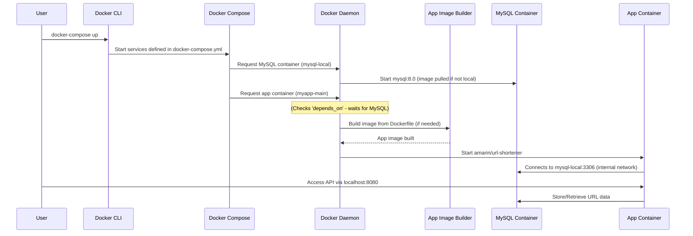

# Chapter 6: Docker Containerization

In the previous chapters, we've built a powerful URL Shortener API. We've seen how [API Endpoints (Controller)](01_api_endpoints__controller__.md) handle requests, how the [URL Business Logic Service](02_url_business_logic_service_.md) performs the core operations, and how it uses a clever [Base Conversion Algorithm](03_base_conversion_algorithm_.md) for short codes. We also explored the [URL Data Model](04_url_data_model_.md) that structures our data, and the [Data Persistence Layer (Repository)](05_data_persistence_layer__repository__.md) that saves and retrieves this data from a MySQL database.

Now, imagine you want to share this amazing URL Shortener with a friend, or deploy it to a server. You send them the code, but they say, "It doesn't work on my machine!" Maybe they have a different version of Java, or their MySQL isn't set up the same way, or they're missing some other tools. This can be frustrating!

This is where **Docker Containerization** comes to the rescue!

## What is Docker Containerization?

Think of Docker as a magical **shipping company** for your software.

*   **The Problem:** Software applications often depend on many other things to run: a specific version of Java, a certain type of database (like MySQL), or other tools. Getting all these pieces set up correctly on every computer can be a headache.
*   **The Solution: Containers!** Docker allows you to package your application and *all* its dependencies into a single, isolated, self-contained unit called a **container**. It's like putting your entire application (and everything it needs) into a sturdy, standard-sized shipping box. This box can then be moved and run on *any* computer that has Docker installed, regardless of that computer's own setup.

### Key Docker Concepts:

1.  **Container:** An isolated, lightweight environment that runs your application. It contains everything your app needs to run: code, runtime (like Java), system tools, libraries, and settings.
    *   **Analogy:** A self-contained, portable shipping box for your software.
2.  **Image:** A read-only template or blueprint for creating containers. It contains the application code, libraries, and settings.
    *   **Analogy:** The detailed manufacturing plan or design for your shipping box. You build a box from this plan, and then you can ship multiple copies of the same box.
3.  **Dockerfile:** A simple text file that contains instructions for Docker on how to build an **image**. It's like a recipe.
    *   **Analogy:** The step-by-step instructions in the factory on how to assemble your shipping box.
4.  **Docker Compose:** A tool for defining and running multi-container Docker applications. It allows you to orchestrate multiple "shipping boxes" (like our application and its database) to work together.
    *   **Analogy:** An orchestra conductor who makes sure all the different musicians (containers) start playing at the right time and work in harmony.

## How Our URL Shortener Uses Docker

Our URL Shortener API needs two main parts to run:
1.  The **Java application** itself (the API).
2.  A **MySQL database** to store the short URLs.

Docker helps us package both of these together so they can be launched with a single command, making local development and deployment incredibly simple and consistent.

### 1. The `Dockerfile`: Building Our Application Image

The `Dockerfile` contains the instructions for building the **image** of our URL Shortener application. It tells Docker: "Start with this base software, copy my code, build it, and then get ready to run it."

Let's break down our `Dockerfile`:

```dockerfile
# Part 1: The Build Stage (Creating the application's executable file)
FROM maven:3.6.3-jdk-11 AS build
COPY src /usr/src/app/src
COPY pom.xml /usr/src/app
RUN mvn -f /usr/src/app/pom.xml clean package -DskipTests=true
```

**Explanation of Part 1:**
*   `FROM maven:3.6.3-jdk-11 AS build`: This line tells Docker to start with a ready-to-use "base image" that already has Java Development Kit (JDK) 11 and Maven (a tool to build Java projects) installed. We call this stage `build`.
*   `COPY src /usr/src/app/src`: Copies our application's source code (`src` folder) into the Docker image.
*   `COPY pom.xml /usr/src/app`: Copies the `pom.xml` file (which tells Maven how to build our project) into the image.
*   `RUN mvn -f /usr/src/app/pom.xml clean package -DskipTests=true`: Executes the Maven command inside the Docker image to compile our Java code and package it into a single `.jar` file (the executable version of our application). We skip tests (`-DskipTests=true`) to make the build faster in Docker.

```dockerfile
# Part 2: The Runtime Stage (Running the application with a smaller image)
FROM openjdk:13-jdk-alpine
COPY --from=build /usr/src/app/target/url-shortener-api-0.0.1-SNAPSHOT.jar /usr/src/app/url-shortener-api-0.0.1-SNAPSHOT.jar
EXPOSE 8080
ENTRYPOINT ["java","-jar","/usr/src/app/url-shortener-api-0.0.1-SNAPSHOT.jar"]
```

**Explanation of Part 2:**
*   `FROM openjdk:13-jdk-alpine`: This starts a *new*, much smaller base image. It only includes the Java Runtime Environment (JRE), which is needed to *run* the app, but not the full JDK or Maven (which are only needed to *build* it). This keeps our final image small and efficient.
*   `COPY --from=build ...`: This is a multi-stage build feature. It copies *only* the built `.jar` file (from the `build` stage) into this smaller runtime image.
*   `EXPOSE 8080`: This tells Docker that our application inside the container will listen for connections on port `8080`. It's like putting a "this container uses port 8080" label on our shipping box.
*   `ENTRYPOINT ["java","-jar","/usr/src/app/url-shortener-api-0.0.1-SNAPSHOT.jar"]`: This specifies the command that Docker should run when a container is started from this image. It simply runs our Java application's `.jar` file.

### 2. The `docker-compose.yml`: Orchestrating Multiple Containers

Our application needs both the Java API and a MySQL database. `docker-compose.yml` is like the conductor that brings these two "musicians" (containers) to life and makes them play together.

```yaml
version: '3'

services:

  mysql-local:
    image: mysql:8.0
    environment:
      - MYSQL_ROOT_PASSWORD=root
      - MYSQL_DATABASE=shortener
      - MYSQL_USER=root
      - MYSQL_PASSWORD=root
    ports:
      - 3306:3306

  myapp-main:
    build:
      context: .
      dockerfile: Dockerfile
    image: amarin/url-shortener
    restart: on-failure
    depends_on:
      - mysql-local
    ports:
      - 8080:8080
```

**Explanation:**
*   `version: '3'`: Specifies the version of the Docker Compose file format.
*   `services:`: This section defines all the different containers that make up our application.

    *   `mysql-local:`: This defines our MySQL database container.
        *   `image: mysql:8.0`: Tells Docker to use a pre-built MySQL version 8.0 image from the public Docker Hub. We don't need a `Dockerfile` for MySQL because a ready-to-use image already exists.
        *   `environment:`: Sets up environment variables inside the MySQL container, like the root password, database name, and user credentials. These match the credentials our [Data Persistence Layer (Repository)](05_data_persistence_layer__repository__.md) uses from `application.properties`.
        *   `ports: - 3306:3306`: This maps port `3306` inside the container (where MySQL runs) to port `3306` on *your computer*. This means you can access the database directly from your computer if needed.

    *   `myapp-main:`: This defines our URL Shortener API application container.
        *   `build:`:
            *   `context: .`: Tells Docker Compose to look for the `Dockerfile` in the current directory.
            *   `dockerfile: Dockerfile`: Specifies the name of the Dockerfile to use for building the image for this service.
        *   `image: amarin/url-shortener`: Gives a custom name to the image that will be built for our application.
        *   `restart: on-failure`: If our application container crashes, Docker Compose will try to restart it.
        *   `depends_on: - mysql-local`: This is very important! It tells Docker Compose that `myapp-main` (our application) needs `mysql-local` (the database) to be running *before* it starts. This prevents errors where our app tries to connect to a database that isn't ready yet.
        *   `ports: - 8080:8080`: This maps port `8080` inside the `myapp-main` container (where our application is `EXPOSE`d) to port `8080` on *your computer*. This is how you can access our API from your browser or other tools via `localhost:8080`.

## How to Use Docker to Run Our URL Shortener

With these two files (`Dockerfile` and `docker-compose.yml`) in place, running our entire URL Shortener application (API + Database) becomes incredibly simple!

1.  **Get the code:** First, you need to download the project code:
    ```sh
    $ git clone https://github.com/AnteMarin/UrlShortener-API.git
    $ cd UrlShortener-API
    ```
    This puts you in the project folder where `Dockerfile` and `docker-compose.yml` are located.

2.  **Start Docker Compose:** Now, simply run the Docker Compose command:
    ```sh
    $ docker-compose up
    ```

    **What happens when you run `docker-compose up`?**
    *   Docker Compose reads the `docker-compose.yml` file.
    *   It sees `mysql-local` and first pulls the `mysql:8.0` image (if you don't have it locally) and starts a container for the database.
    *   It then sees `myapp-main` and uses the `Dockerfile` to *build* the application image (if it hasn't been built before or if the code has changed).
    *   Once the `myapp-main` image is ready, it starts a container for our application.
    *   Because of `depends_on`, Docker ensures the MySQL container is running before attempting to start `myapp-main`.
    *   Both containers will be running in your terminal, showing logs from both the application and the database.

3.  **Access the API:** Once both services are up and running, you can open your web browser and go to `localhost:8080/swagger-ui.html`. This will take you to the interactive API documentation (from [Chapter 1: API Endpoints (Controller)](01_api_endpoints__controller__.md)), where you can test the URL shortening and redirection features!

    *   **Input for shortening:**
        ```json
        {
            "longUrl": "https://www.example.com/very/long/path/to/my/favorite/page.html",
            "expiresDate": "2024-12-31T23:59:59.000+00:00"
        }
        ```
    *   **Output for shortening:** A short URL like `http://localhost:8080/api/v1/AbCdE`

    When you visit `http://localhost:8080/api/v1/AbCdE` in your browser, Docker routes the request to our `myapp-main` container, which then interacts with the `mysql-local` container to find the original long URL and redirect your browser!

### Internal Implementation: The Docker Workflow

Here's a simplified sequence of what happens behind the scenes when you run `docker-compose up`:



This diagram shows how Docker Compose acts as the orchestrator, telling the Docker Daemon to create and manage the individual containers. The `App Container` and `MySQL Container` can communicate with each other using their service names (`mysql-local`) within Docker's internal network.

## Conclusion

**Docker Containerization** is a game-changer for deploying and managing applications. It allows us to:

*   **Package our entire application** (including its Java runtime) into a consistent, isolated image.
*   **Orchestrate multiple services** (our application and its MySQL database) to run together seamlessly.
*   **Ensure consistency** across different environments, solving the "it works on my machine!" problem.
*   **Simplify deployment** by reducing the entire setup process to a single `docker-compose up` command.

By containerizing our `UrlShortener-API`, we've made it incredibly easy for anyone to run it, regardless of their local machine's configuration. This marks the end of our tutorial series on the `UrlShortener-API`. You now have a comprehensive understanding of its core components, from API endpoints to data persistence and containerization!

--- 
